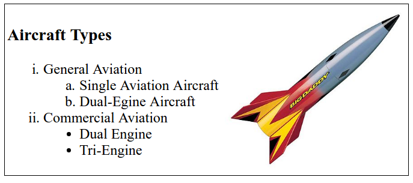
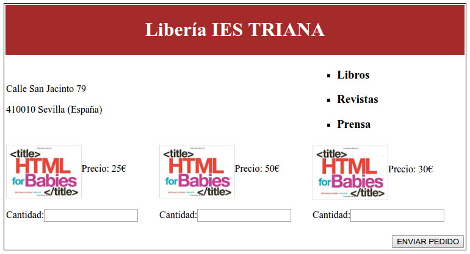

# HTML EXAM
## 08-11-2017

### EXERCISE 01 (4 points)

2. Using HTML tags build a web as close as possible to the image below.

All the elements must be centered on the page and when clicking on the image a new tab must be open showing the http://www.nasa.gov site

### EXERCISE 02 (6 points)

1. Using HTML tags build a web as close as possible to the image below.

Notes:

All the elements must be centered on the page
