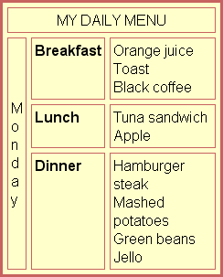
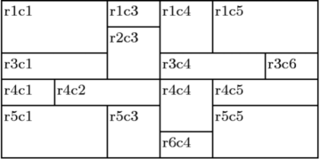

##Exercise 1:

In a file called ex1.html write the HMLT needed for creating a web page as close as possible as the following image:

**Note: You must look for further info in order to get the the proper list icons and the right table borders.**

##Exercise 2:

In a file called ex2.html write the HMLT needed for creating a web page as close as possible as the following image

**Note: You must look for further info in order to get the the proper color and the proper borders**

##Exercise 3:

In a file called ex3.html write the HMLT needed for creating a web page as close as possible as the following image.

Exercise 4:

In a file called ex4.html write the HMLT needed for creating a web page as close as possible as the following image.

**Note: The device images must link to the official device website. You must look or create your own images.**
